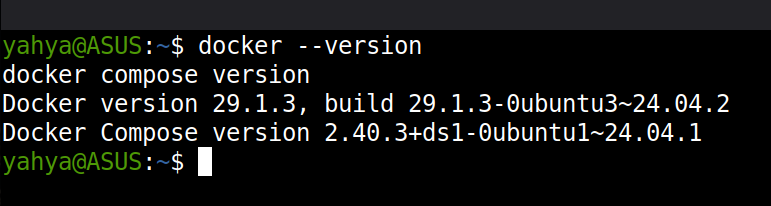
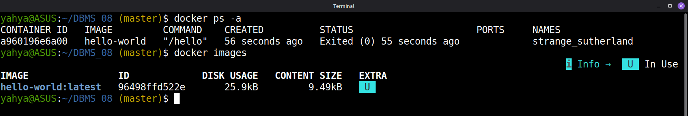
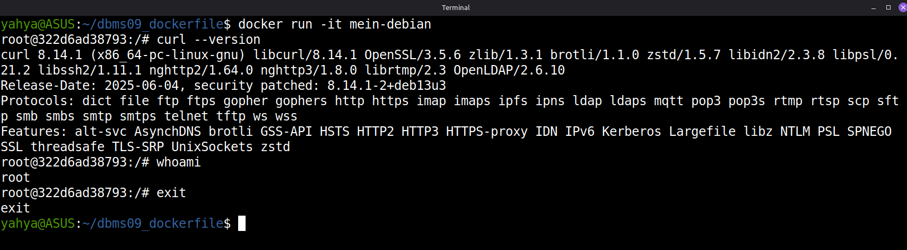
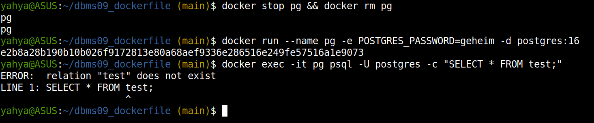
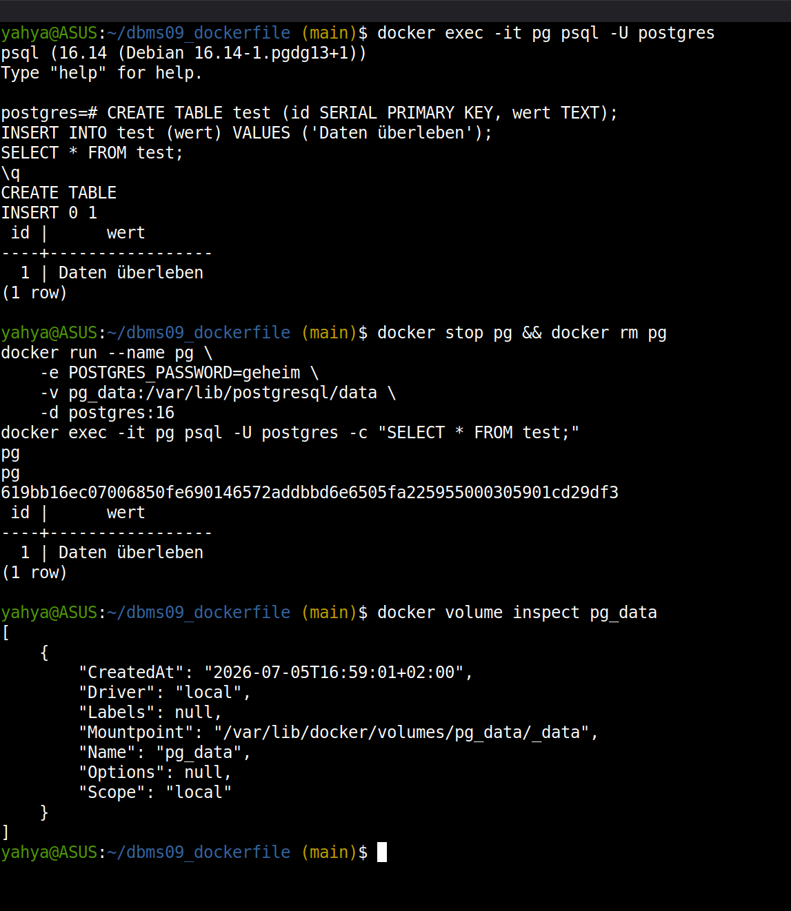
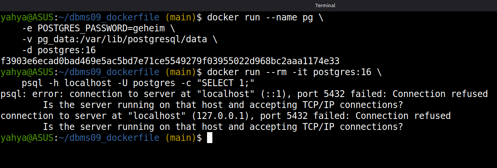
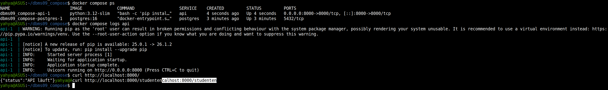
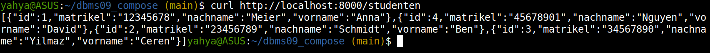
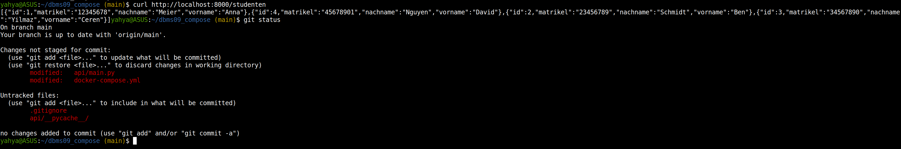
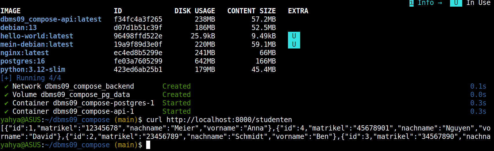

# DBMS_09 – From Container to Docker Compose

**Module:** Databases · THGA Bochum  
**Lecturer:** Stephan Bökelmann · <sboekelmann@ep1.rub.de>  
**Repository:** <https://github.com/MaxClerkwell/DBMS_09>  
**Prerequisites:** DBMS_01 – DBMS_07, Lecture 09  
**Duration:** 120 minutes

---

## Learning Objectives

After completing this exercise you will be able to:

- Explain the difference between a **container** and a **virtual machine**
- Start, inspect, and remove Docker **containers** and **images**
- Write a minimal **Dockerfile** and build a custom image from it
- Demonstrate the **ephemeral** nature of container storage
- Attach a **named volume** to a PostgreSQL container and verify data persists
  across container restarts
- Explain why running two services in one container is an anti-pattern
- Connect two containers via a **custom bridge network** using container names
  as hostnames
- Describe all key sections of a **docker-compose.yml** file
- Start a multi-service application with `docker compose up` and take it down
  cleanly
- Use a **`.env` file** to keep credentials out of `docker-compose.yml`
- Explain what a **Multi-Stage Build** is and why it reduces image size
- Apply the **Principle of Least Privilege** by running containers as a
  non-root user
- Use **init scripts** to initialise a PostgreSQL database on first start

**After completing this exercise you should be able to answer the following questions independently:**

- What is the difference between a Docker image and a running container?
- Why does deleting a container without a volume lose all data written to it?
- Why can `host="localhost"` inside one container not reach a second container?
- What does `docker compose down -v` do that `docker compose down` does not?
- Why should credentials never appear directly in `docker-compose.yml`?

---

## Prerequisites Check

You need Docker and Docker Compose installed.

```bash
docker --version
docker compose version
```

> Both commands should succeed and show version numbers.

> **Screenshot 1:** Take a screenshot showing both version outputs.
>
> 

---

## 1 – Hello Container

### Step 1 – Run the hello-world Image

```bash
docker run hello-world
```

> Docker pulls the image from Docker Hub (first run only), starts a container,
> prints a message, and exits.

List all containers, including stopped ones:

```bash
docker ps -a
docker images
```

> **Screenshot 2:** Take a screenshot showing `docker ps -a` and
> `docker images` output.
>
> 

### Step 2 – Run an nginx Webserver

```bash
docker run -d -p 8080:80 --name webserver nginx
curl http://localhost:8080
docker logs webserver
docker exec -it webserver bash
```

Inside the container shell, inspect the running process and exit:

```bash
ps aux
exit
```

Stop and remove the container:

```bash
docker stop webserver && docker rm webserver
docker system df
```

### Questions for Section 1

**Question 1.1:** The flag `-d` starts the container in detached mode.
What happens without `-d`, and why is detached mode useful for a web server?

> Without -d, the container runs in the foreground and blocks the terminal, with nginx's logs streaming to stdout until Ctrl+C stops it.
> Detached mode is better for a web server since it's a long-running background service. It should keep running while you use the terminal for docker logs, docker exec, curl, and so on.

**Question 1.2:** `-p 8080:80` maps host port 8080 to container port 80.
Which port is the application actually listening on inside the container?
What would `-p 9000:80` change?

> The application listens on port 80 inside the container, nginx's default port. -p 8080:80 maps host:container.
> With -p 9000:80, only the host-side port changes: the server is now reachable at http://localhost:9000, while inside the container it's still port 80.

---

## 2 – Writing a Dockerfile

### Step 1 – Create the Project Directory

```bash
mkdir ~/dbms09_dockerfile
cd ~/dbms09_dockerfile
git init
git remote add origin git@github.com:<your-username>/dbms09_dockerfile.git
```

### Step 2 – Write the Dockerfile

```bash
vim Dockerfile
```

```dockerfile
FROM debian:13
RUN apt-get update && apt-get install -y curl \
    && rm -rf /var/lib/apt/lists/*
CMD ["bash"]
```

### Step 3 – Build and Run

```bash
docker build -t mein-debian .
docker run -it mein-debian
```

Inside the container:

```bash
curl --version
whoami
exit
```

> **Screenshot 3:** Take a screenshot showing the `docker build` output and
> the commands run inside the container.
>
> 

### Step 4 – Commit

```bash
git add Dockerfile
git commit -m "feat: minimal Debian image with curl"
git push -u origin main
```

### Questions for Section 2

**Question 2.1:** Why does the `RUN` instruction combine `apt-get update`,
`apt-get install`, and `rm -rf /var/lib/apt/lists/*` in a single line?
What would happen to the image size if these were three separate `RUN` lines?

> Each RUN instruction creates its own immutable layer. Put rm -rf /var/lib/apt/lists/* in a separate RUN and it only deletes files in the new layer, not the ~50 MB
> apt-lists layer underneath.
> Combining update, install, and cleanup in one layer is what actually shrinks the image. Combining update and install also avoids stale-cache issues, since a cached
> old apt-get update layer can cause failed installs later.

**Question 2.2:** `EXPOSE 80` in a Dockerfile does **not** actually open port
80. What does it do, and what is required at `docker run` time to actually
forward a port?

> EXPOSE is purely documentation/metadata: it declares which port the application listens on (visible via docker inspect, used by -P).
> To actually reach the port, you need -p <host>:<container> (port mapping) at docker run time, or ports: in Compose.

---

## 3 – The Persistence Problem

### Step 1 – Start a PostgreSQL Container Without a Volume

```bash
docker run --name pg \
    -e POSTGRES_PASSWORD=geheim \
    -d postgres:16
```

Connect and create a table:

```bash
docker exec -it pg psql -U postgres
```

Inside `psql`:

```sql
CREATE TABLE test (id SERIAL PRIMARY KEY, wert TEXT);
INSERT INTO test (wert) VALUES ('Hallo Docker');
SELECT * FROM test;
\q
```

### Step 2 – Destroy and Recreate the Container

```bash
docker stop pg && docker rm pg
docker run --name pg -e POSTGRES_PASSWORD=geheim -d postgres:16
docker exec -it pg psql -U postgres -c "SELECT * FROM test;"
```

> Expected output: `ERROR: relation "test" does not exist`

> **Screenshot 4:** Take a screenshot showing the error message.
>
> 

### Questions for Section 3

**Question 3.1:** You stopped and removed the container but the image
`postgres:16` still exists on your machine. Why does recreating a container
from the same image not restore the data?

> The image is a read-only template. It contains only the PostgreSQL installation, no data.
> When a container starts, a writable layer sits on top of the image, and all writes, like the table in /var/lib/postgresql/data, go only into that layer. docker rm deletes the layer. A new container starts fresh from the same unchanged image, with an empty layer on top.

**Question 3.2:** `docker stop` sends SIGTERM and waits for the process to
exit cleanly. `docker kill` sends SIGKILL immediately. Why is `docker stop`
preferred for a database container?

> SIGTERM gives PostgreSQL a chance to shut down cleanly: finish open transactions, flush dirty pages from the shared buffer to disk, and close the WAL properly. SIGKILL terminates the process immediately, risking an inconsistent data state and forcing crash recovery via the WAL on next startup (worst case: loss of uncommitted/unflushed data).

---

## 4 – Named Volumes

### Step 1 – Create a Volume and Attach It

```bash
docker volume create pg_data
docker run --name pg \
    -e POSTGRES_PASSWORD=geheim \
    -v pg_data:/var/lib/postgresql/data \
    -d postgres:16
```

Insert data:

```bash
docker exec -it pg psql -U postgres
```

```sql
CREATE TABLE test (id SERIAL PRIMARY KEY, wert TEXT);
INSERT INTO test (wert) VALUES ('Daten überleben');
SELECT * FROM test;
\q
```

### Step 2 – Destroy and Recreate With the Same Volume

```bash
docker stop pg && docker rm pg
docker run --name pg \
    -e POSTGRES_PASSWORD=geheim \
    -v pg_data:/var/lib/postgresql/data \
    -d postgres:16
docker exec -it pg psql -U postgres -c "SELECT * FROM test;"
```

> The data should still be there.

```bash
docker volume ls
docker volume inspect pg_data
```

> **Screenshot 5:** Take a screenshot showing the `SELECT` result after
> container recreation, and the `docker volume inspect` output.
>
> 

### Step 3 – Clean Up

```bash
docker stop pg && docker rm pg
docker volume rm pg_data
```

### Questions for Section 4

**Question 4.1:** `docker volume inspect pg_data` shows a `Mountpoint` on
the host filesystem. Why is it still recommended to use named volumes instead
of bind-mounting that path directly with `-v /var/lib/docker/volumes/...`?

> *Your answer:*

**Question 4.2:** You want to back up the database. Which `docker` command
lets you copy files out of a running container, and how would you copy the
volume contents to a `.tar.gz` archive on the host?

> `docker cp` copies files out of a running container. For a volume backup, the standard approach is a helper container that mounts the volume and tars it:
```bash
docker run --rm \
  -v pg_data:/data:ro \
  -v $(pwd):/backup \
  debian:13 tar czf /backup/pg_data.tar.gz -C /data .
```
---

## 5 – Two Containers and the Network Problem

### Step 1 – Reproduce the Connectivity Failure

Start PostgreSQL:

```bash
docker run --name pg \
    -e POSTGRES_PASSWORD=geheim \
    -v pg_data:/var/lib/postgresql/data \
    -d postgres:16
```

Start a second container and try to reach the first via `localhost`:

```bash
docker run --rm -it postgres:16 \
    psql -h localhost -U postgres -c "SELECT 1;"
```

> This should fail with a connection refused error.

> **Screenshot 6:** Take a screenshot showing the connection error.
>
> 

### Step 2 – Fix It With a Custom Bridge Network

```bash
docker network create mein-netz

docker stop pg && docker rm pg
docker run --name pg \
    -e POSTGRES_PASSWORD=geheim \
    -v pg_data:/var/lib/postgresql/data \
    --network mein-netz \
    -d postgres:16

docker run --rm -it \
    --network mein-netz \
    postgres:16 \
    psql -h pg -U postgres -c "SELECT 1;"
```

> Notice that `-h pg` uses the **container name** as the hostname — Docker's
> internal DNS resolves it automatically.

```bash
docker network inspect mein-netz
```

### Step 3 – Clean Up

```bash
docker stop pg && docker rm pg
docker network rm mein-netz
docker volume rm pg_data
```

### Questions for Section 5

**Question 5.1:** Without a custom bridge network, containers are placed on
the default bridge. Why can containers on the default bridge **not** resolve
each other by name, while containers on a user-defined bridge can?

> On the default bridge, Docker doesn't provide built-in DNS resolution for container names, for legacy compatibility reasons: containers can only see each other via IP addresses (older setups used the now-deprecated --link). User-defined bridges, however, get Docker's built-in DNS server (127.0.0.11), which automatically resolves container names to their current IPs, and also provide network isolation.

**Question 5.2:** You could find the IP address of the `pg` container with
`docker inspect` and hard-code it. Why is using the container name as a
hostname strongly preferable?

> Container IPs aren't stable because on every restart/recreate, a container can get a different IP from the subnet, breaking a hardcoded connection.
> The name stays constant, and Docker's DNS always resolves it to the current IP.
> Names are also human-readable, document the architecture, and work identically inside Compose.

---

## 6 – Docker Compose

Managing multiple `docker run` commands by hand is error-prone. Docker Compose
describes an entire multi-service application in a single YAML file.

### Step 1 – Create the Project

```bash
mkdir ~/dbms09_compose
cd ~/dbms09_compose
git init
git remote add origin git@github.com:<your-username>/dbms09_compose.git
```

### Step 2 – Write docker-compose.yml

```bash
vim docker-compose.yml
```

```yaml
services:
  postgres:
    image: postgres:16
    environment:
      POSTGRES_USER: vorlesung
      POSTGRES_PASSWORD: geheim
      POSTGRES_DB: vorlesung
    volumes:
      - pg_data:/var/lib/postgresql/data
    networks:
      - backend

  api:
    image: python:3.12-slim
    working_dir: /app
    volumes:
      - ./api:/app
    command: >
      bash -c "pip install fastapi uvicorn psycopg2-binary --quiet
               && uvicorn main:app --host 0.0.0.0 --port 8000"
    ports:
      - "8000:8000"
    depends_on:
      - postgres
    networks:
      - backend

volumes:
  pg_data:

networks:
  backend:
```

### Step 3 – Create the API Code

```bash
mkdir api
vim api/main.py
```

```python
import psycopg2
import psycopg2.extras
from fastapi import FastAPI

app = FastAPI(title="Studenten-API")

DB_CONFIG = {
    "dbname": "vorlesung",
    "user": "vorlesung",
    "password": "geheim",
    "host": "postgres",   # container name as hostname
    "port": 5432,
}

@app.get("/")
def root():
    return {"status": "API läuft"}

@app.get("/studenten")
def alle_studenten():
    conn = psycopg2.connect(**DB_CONFIG)
    cur = conn.cursor(cursor_factory=psycopg2.extras.RealDictCursor)
    cur.execute("SELECT id, matrikel, nachname, vorname FROM student ORDER BY nachname")
    rows = cur.fetchall()
    cur.close()
    conn.close()
    return rows
```

### Step 4 – Start and Test

```bash
docker compose up -d
docker compose ps
docker compose logs api
```

Wait for the API to start, then test:

```bash
curl http://localhost:8000/
curl http://localhost:8000/studenten
```

> The `/studenten` endpoint will return an empty list for now — that is
> expected. You will add the schema in Section 7.

> **Screenshot 7:** Take a screenshot showing `docker compose ps` and the
> `curl /` response.
>
> 

### Step 5 – Observe Compose Networking

```bash
docker network ls
docker network inspect dbms09_compose_backend
```

> Compose automatically prefixes network names with the project directory name.

### Step 6 – Take It Down

```bash
docker compose down
docker compose down -v   # also removes the named volume
```

> **Question:** What is the difference between `down` and `down -v`?
> When would you use each?
> Answer: `down` stops and removes containers and networks, but leaves named volumes (i.e., the DB data) intact. `down -v` also deletes the volumes and the data is gone. Use `down` in normal operation; use `down -v` when you want a completely fresh state (e.g., to re-run init scripts).

### Step 7 – Commit

```bash
git add docker-compose.yml api/main.py
git commit -m "feat: initial docker-compose setup with postgres and api"
git push -u origin main
```

### Questions for Section 6

**Question 6.1:** `depends_on: postgres` ensures the `postgres` service
starts before `api`. Does it guarantee that PostgreSQL is **ready to accept
connections** when the API starts? What is the correct way to handle this?

> No. depends_on only controls the startup order of containers, not application readiness because PostgreSQL still needs a few seconds after container start to finish initializing. The correct approach is a healthcheck on the postgres service (pg_isready) combined with depends_on: postgres: condition: service_healthy:
```bash
postgres:
    healthcheck:
      test: ["CMD-SHELL", "pg_isready -U vorlesung"]
      interval: 5s
      retries: 5
  api:
    depends_on:
      postgres:
        condition: service_healthy
```

**Question 6.2:** The `api` service uses `volumes: - ./api:/app` (a bind
mount). What is the advantage of this during development compared to
`COPY`-ing the code into an image at build time?

> With the bind mount, the container sees code changes immediately: you edit main.py on the host and just restart the process (or run uvicorn with --reload), without rebuilding the image. With COPY, every change would require a docker compose build. For development: faster iteration cycle; for production, COPY is better (immutable, reproducible image).

---

## 7 – Init Script for PostgreSQL

The official `postgres` image runs all scripts placed in
`/docker-entrypoint-initdb.d/` on first start. This lets you initialise the
schema automatically.

### Step 1 – Write init.sql

```bash
vim init.sql
```

```sql
CREATE TABLE IF NOT EXISTS student (
    id        INTEGER GENERATED ALWAYS AS IDENTITY PRIMARY KEY,
    matrikel  CHAR(8)      NOT NULL UNIQUE,
    nachname  VARCHAR(100) NOT NULL,
    vorname   VARCHAR(100) NOT NULL,
    email     VARCHAR(200)
);

INSERT INTO student (matrikel, nachname, vorname, email) VALUES
    ('12345678', 'Meier',   'Anna',  'a.meier@stud.thga.de'),
    ('23456789', 'Schmidt', 'Ben',   'b.schmidt@stud.thga.de'),
    ('34567890', 'Yilmaz',  'Ceren', 'c.yilmaz@stud.thga.de'),
    ('45678901', 'Nguyen',  'David', 'd.nguyen@stud.thga.de');
```

### Step 2 – Mount the Script in docker-compose.yml

Add a bind mount to the `postgres` service so the script lands in the init
directory:

```yaml
  postgres:
    image: postgres:16
    environment:
      POSTGRES_USER: vorlesung
      POSTGRES_PASSWORD: geheim
      POSTGRES_DB: vorlesung
    volumes:
      - pg_data:/var/lib/postgresql/data
      - ./init.sql:/docker-entrypoint-initdb.d/init.sql
    networks:
      - backend
```

### Step 3 – Reinitialise and Test

The init script only runs when the data directory is empty. Remove the
existing volume first:

```bash
docker compose down -v
docker compose up -d
```

Wait a moment, then query the data:

```bash
curl http://localhost:8000/studenten
```

> You should now see all four students in the JSON response.

> **Screenshot 8:** Take a screenshot showing the `curl /studenten` response
> with all four rows.
>
> 

### Step 4 – Commit

```bash
git add init.sql docker-compose.yml
git commit -m "feat: add init.sql for automatic schema and seed data"
git push
```

### Questions for Section 7

**Question 7.1:** You run `docker compose down` (without `-v`), change
`init.sql`, and run `docker compose up -d` again. The schema change does
**not** appear in the database. Why not, and how do you force re-initialisation?

> The scripts in /docker-entrypoint-initdb.d/ only run when the data directory is empty, i.e., only on the very first initialization.
> After down without -v, the volume still exists with the old data, so the entrypoint script skips initialization.
> Fix: docker compose down -v (delete the volume), then up and now it re-initializes.
> In production you'd instead apply schema changes via migrations (e.g., Flyway, Alembic).

**Question 7.2:** `GENERATED ALWAYS AS IDENTITY` is used instead of
`SERIAL`. What is the practical difference? Which one is the modern
SQL-standard approach?

> SERIAL is PostgreSQL-proprietary shorthand that implicitly creates a sequence but the column can still be manually overwritten with arbitrary values,
> which can cause sequence conflicts. GENERATED ALWAYS AS IDENTITY is the SQL standard (SQL:2003): the sequence is tightly bound to the column
> (cleaner management, DROP cleans it up automatically), and ALWAYS prevents accidental manual inserts into the ID column (only bypassable with OVERRIDING SYSTEM VALUE).
> Identity is the modern, portable approach.

---

## 8 – Secrets via .env

Passwords must not appear in `docker-compose.yml` because that file is
committed to version control.

### Step 1 – Create .env

```bash
vim .env
```

```
POSTGRES_USER=vorlesung
POSTGRES_PASSWORD=geheim
POSTGRES_DB=vorlesung
```

### Step 2 – Reference Variables in docker-compose.yml

Replace the hard-coded values in the `postgres` service:

```yaml
    environment:
      POSTGRES_USER: ${POSTGRES_USER}
      POSTGRES_PASSWORD: ${POSTGRES_PASSWORD}
      POSTGRES_DB: ${POSTGRES_DB}
```

Also update `api/main.py` to read the password from the environment:

```python
import os

DB_CONFIG = {
    "dbname": os.environ.get("POSTGRES_DB", "vorlesung"),
    "user": os.environ.get("POSTGRES_USER", "vorlesung"),
    "password": os.environ.get("POSTGRES_PASSWORD", ""),
    "host": "postgres",
    "port": 5432,
}
```

Add `env_file` to the `api` service in `docker-compose.yml`:

```yaml
  api:
    ...
    env_file: .env
```

### Step 3 – Gitignore .env

```bash
echo ".env" >> .gitignore
```

### Step 4 – Restart and Verify

```bash
docker compose down -v
docker compose up -d
curl http://localhost:8000/studenten
```

> The response should be identical to before.

### Step 5 – Commit

```bash
git add docker-compose.yml api/main.py .gitignore
git commit -m "feat: move credentials to .env file"
git push
```

> **Do not add `.env` to the commit.** Confirm with `git status` that it
> is untracked.

> **Screenshot 9:** Take a screenshot showing `git status` confirming
> `.env` is not staged, and the working `curl` response.
>
> 

### Questions for Section 8

**Question 8.1:** A teammate clones your repository and runs
`docker compose up -d`. The application fails because `.env` is missing.
What is the standard practice to document which variables are required
without committing the actual secrets?

> You commit an .env.example (or .env.template) file containing all required variable names but with placeholder/dummy values:
```bash
POSTGRES_USER=vorlesung
POSTGRES_PASSWORD=changeme
POSTGRES_DB=vorlesung
```

**Question 8.2:** Even with `.env` excluded from git, the password is still
stored in plain text on disk. Name one mechanism Docker provides for
production-grade secret management that avoids plain-text env files entirely.

> Docker Secrets (native in Docker Swarm, also usable in Compose via secrets:): secrets are stored encrypted in the cluster and provided to the container only at runtime as an in-memory file under /run/secrets/<name>  never as an environment variable, never in the image, never in plain text on the container's disk.

---

## 9 – Multi-Stage Build

A Python image that includes `pip`, build tools, and cache is larger than
necessary. A Multi-Stage Build separates dependency installation from the
final runtime image.

### Step 1 – Create an api/Dockerfile

```bash
vim api/Dockerfile
```

```dockerfile
FROM python:3.12-slim AS builder
WORKDIR /app
COPY pyproject.toml .
RUN pip install uv && uv sync --no-dev

FROM python:3.12-slim
WORKDIR /app
COPY --from=builder /app/.venv .venv
COPY . .
ENV PATH="/app/.venv/bin:$PATH"
EXPOSE 8000
CMD ["uvicorn", "main:app", "--host", "0.0.0.0", "--port", "8000"]
```

### Step 2 – Add pyproject.toml

```bash
vim api/pyproject.toml
```

```toml
[project]
name = "studenten-api"
version = "0.1.0"
requires-python = ">=3.11"
dependencies = [
    "fastapi",
    "uvicorn[standard]",
    "psycopg2-binary",
]
```

### Step 3 – Switch the api Service to Use the Build

Replace the `image:` key with `build:` in the `api` service:

```yaml
  api:
    build: ./api
    ports:
      - "8000:8000"
    depends_on:
      - postgres
    env_file: .env
    networks:
      - backend
```

Remove the `volumes: - ./api:/app` bind mount and the `command:` key — they
were only needed for the quick-start approach.

### Step 4 – Build and Test

```bash
docker compose down -v
docker compose build
docker images    # compare sizes
docker compose up -d
curl http://localhost:8000/studenten
```

> **Screenshot 10:** Take a screenshot showing `docker images` with the
> final image size and the working `curl` response.

> 

### Step 5 – Commit

```bash
git add api/Dockerfile api/pyproject.toml docker-compose.yml
git commit -m "feat: multi-stage Dockerfile for slim production image"
git push
```

### Questions for Section 9

**Question 9.1:** `COPY --from=builder /app/.venv .venv` copies the virtual
environment from the builder stage. The final image does not contain `pip` or
`uv`. What security advantage does this provide?

> Smaller attack surface: without pip/uv and build tools, an attacker who breaks into the container can't simply install additional packages/tools.
> Less installed software also means fewer potential CVEs in the image.
> The final image contains only what's actually needed at runtime.

**Question 9.2:** The builder stage installs dependencies from `pyproject.toml`
before copying the application code. Why does this ordering improve build
cache efficiency when you frequently change only `main.py`?

> Docker caches layers and invalidates the cache starting from the first changed instruction.
> Since COPY pyproject.toml plus the dependency install happen before COPY . ., the expensive install layer stays cached as long as only main.py changes and the rebuild then only re-copies the code and takes seconds instead of minutes.
> If COPY . . came first, every code change would trigger a full dependency reinstall.

---

## 10 – Non-Root User

Containers run as `root` by default. If an attacker escapes the container,
they have root on the host.

### Step 1 – Add a Non-Root User to the Dockerfile

Open `api/Dockerfile` and add the user before the `CMD`:

```dockerfile
FROM python:3.12-slim AS builder
WORKDIR /app
COPY pyproject.toml .
RUN pip install uv && uv sync --no-dev

FROM python:3.12-slim
WORKDIR /app
COPY --from=builder /app/.venv .venv
COPY . .
ENV PATH="/app/.venv/bin:$PATH"
RUN adduser --disabled-password --gecos "" appuser
USER appuser
EXPOSE 8000
CMD ["uvicorn", "main:app", "--host", "0.0.0.0", "--port", "8000"]
```

### Step 2 – Rebuild and Verify

```bash
docker compose build
docker compose up -d
docker compose exec api whoami
```

> Expected output: `appuser`

> **Screenshot 11:** Take a screenshot showing `docker compose exec api whoami`
> returning `appuser`.
>
> 

### Step 3 – Commit

```bash
git add api/Dockerfile
git commit -m "feat: run api container as non-root appuser"
git push
```

### Questions for Section 10

**Question 10.1:** The `USER appuser` instruction is placed after
`COPY . .`. Why would placing it *before* `COPY` cause a permission problem?

> COPY (and RUN) run as whatever USER is currently set. If USER appuser were placed before COPY . ., the copied files would still be owned by root (COPY without --chown sets root:root as owner), but more importantly: all subsequent RUN commands would no longer have root privileges — e.g., adduser itself, or writes to system paths, could fail, and depending on directory permissions, appuser might not even be able to write into /app. Best practice: set everything up as root first (optionally using COPY --chown=appuser:appuser), then set USER appuser last.

**Question 10.2:** State the **Principle of Least Privilege** in one
sentence, and name one other place in a typical web application stack
(outside of containers) where this principle is applied.

> Principle of Least Privilege: every component (user, process, service) should be granted only the minimal privileges it needs to do its job.
> Another example in a typical web stack: the application's database user gets only SELECT/INSERT/UPDATE/DELETE on the tables it needs, but no DROP, CREATE, or superuser rights.

---

## 11 – Reflection

**Question A – The Monolith Anti-Pattern:**  
Section 6 of the lecture shows a Dockerfile that runs both PostgreSQL and
FastAPI in a single container. Describe two concrete operational problems
this causes in a production environment.

> Independent scaling is impossible: if the API needs more instances, you'd have to duplicate the whole container including the database — but running multiple PostgreSQL instances against the same data isn't possible/sensible. (2) Lifecycle and failure coupling: updating or crashing the API forces a restart of the database too (unnecessary downtime, recovery risk); you also need a process manager inside the container since Docker only supervises one main process — if the second process dies, Docker won't notice (logs, healthchecks, and restart policies only work cleanly per container).

**Question B – Volume vs. Bind Mount:**  
Compare named volumes and bind mounts. When is each type appropriate?

> Volume vs. Bind Mount: Named volumes are managed by Docker, portable, performant, and the right place for persistent application data (database files in production). Bind mounts map a specific host path into the container — ideal for development (live code changes, like our ./api:/app) and for config/init files (./init.sql:...), but host-dependent and prone to permission issues. Rule of thumb: data → volume, code/config in dev → bind mount.

**Question C – Compose and Reproducibility:**  
A colleague says: "I can just write the `docker run` commands in a shell
script — why do I need `docker-compose.yml`?" Give two specific advantages
of Compose over a shell script of `docker run` commands.

> Compose vs. Shell Script: (1) Declarative + state management: Compose describes the desired end state; docker compose up detects what's already running, what changed, and only creates/updates what's needed — a shell script blindly executes commands and fails if containers/networks already exist; clean teardown (down, down -v) comes for free. (2) Automatic infrastructure and a standard format: Compose creates project-scoped networks and volumes, manages dependencies (depends_on, healthchecks), and is a documented, tool-supported format that any teammate or CI pipeline understands immediately — instead of custom, error-prone script code.

**Question D – The Complete Chain:**  
You have now built and containerised the full stack: PostgreSQL in a
container with a named volume and init script → FastAPI in a slim
non-root image → both orchestrated by Docker Compose with credentials
in `.env`. Describe in two sentences what each layer contributes to
**portability** and **security**.

> The Complete Chain: The named volume and the init script make the data persistent and reproducible, independent of the container lifecycle, while the multi-stage image packages the API as a small artifact that runs identically everywhere — Compose ties both together declaratively, so the entire application starts with one command on any Docker host (portability). Security comes from layering: credentials live outside version control in .env, the slim image without build tools minimizes the attack surface, and the non-root user limits the damage if a container is compromised (least privilege).

---

## Further Reading

- [Docker – Get started](https://docs.docker.com/get-started/)
- [Docker – Volumes](https://docs.docker.com/storage/volumes/)
- [Docker – Networking overview](https://docs.docker.com/network/)
- [Docker Compose – Reference](https://docs.docker.com/compose/compose-file/)
- [Docker – Multi-stage builds](https://docs.docker.com/build/building/multi-stage/)
- [postgres Docker Hub – Environment variables](https://hub.docker.com/_/postgres)
- Lecture 09 handout
